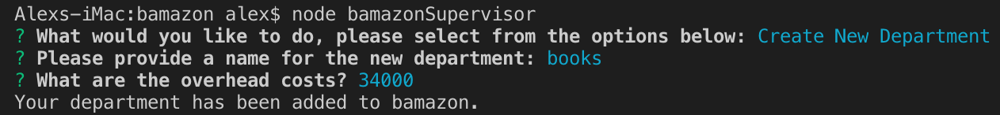

# bamazon
A virtual store exhibiting inventory tracking and dynamic updates from user input

### Project Overview
This project mimics a virtual store.  The client interacts with prompts in the command-line interface and based on their input, the store database will be updated. 

### Initializing the database with mySQL
All of the data lives in a single database, except the total profit column which is generated dynamically upon user request.  There are two tables in the database: Products and Departments.  Departments is only visible to the supervisor.
* run the scripts provided in the schema.sql file
* next run the scripts in the seeds.sql file, feel free to populate the table with items and figures to your liking
* NOTE: All mySQL scripting can be done in the MySQL Workbench application available here: https://www.mysql.com/downloads/

##### The customer app (bamazonCustomer.js) allows a customer to view products and purchase.   

##### The manager app (bamazonManager.js) allows one to either:
* View Products for Sale
* View Low Inventory
* Add to Inventory
* Add New Product

#### Video Demo
* download the video below to watch a demo of the customer and manager functionality

##### The supervisor app (bamazonSupervisor.js) allows one to either:
* View a table of departments, including their total sales and profit
* Add a new department

### Technologies Used:
* Node.js
* mySQL
* Javascript
* Inquirer.js
* CLI-table

### Next Steps
* Use .env file and gitignore to secure database pw
* Include COG column in products table to be referenced when determining the cost of increasing inventory and attributing this value to the overhead_costs total for each product
* Permit returns throught customer app
* Record date of transaction to be referenced later for sales by time period or setting refund time window

##### Authored by me: https://akluger.github.io/Bootstrap-Portfolio/